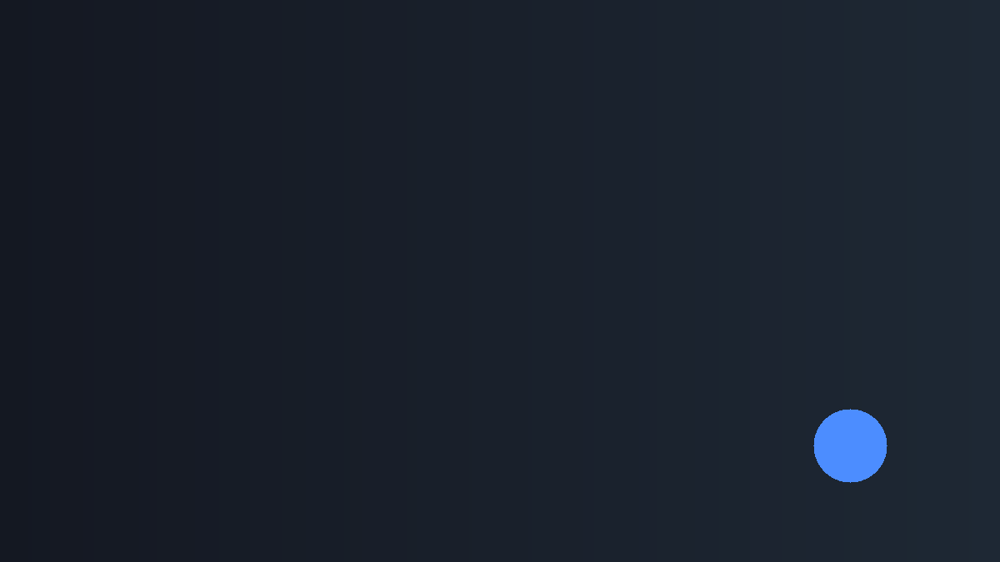

# dsh-bell-notify 🔔

[English](./README.en.md) · [中文](./README.md)

**dsh-bell-notify** is a community plugin for [DeepSeek Harness](https://github.com/deepseek-ai/deepseek-harness) (`dsh`) that gives your Agent **ears and a heartbeat**: it rings along with every step of the work, while a tiny breathing dot in the corner tells you what it's up to at a glance.

No audio files — every bell is synthesized in real time with the Web Audio API. And every single event can be swapped for your own sound file. It's a small thing that builds a little bit of unspoken rapport between you and your Agent.

> Not part of the official DeepSeek distribution. An MIT-licensed community plugin.

## Screenshot

<!-- Put your screenshot in docs/ (e.g. docs/screenshot.png) and point `src` at it. -->



## What it does

### 🎵 A distinct bell for every step

Every move the Agent makes rings once, and each one sounds different:

| Event | Default bell | Feels like |
|-------|-------------|-----------|
| Session start | `startup` | A soft upward sweep, like powering on |
| Agent start | `click` | A short "ding", we're off |
| Thinking | `notify` | A gentle single note, settling in |
| Tool call | `tick` | A crisp metallic "ta-ta" |
| Tool done | `drop` | A low settle, wrapping up |
| Command run | `beep` | A short beep, terminal-flavored |
| Command done | `rise` | A rising two-note "done" |
| Waiting for you | `alert` | A high triple-chirp, look here |
| Turn complete | `success` | A rising major chord, satisfying |
| Back to idle | `confirm` | A single note drifting down, quiet again |

> `error` and `failure` are built in too, off by default — wire them up in config if you like.

### 🎛️ Swap in your own sounds

Don't like a bell? **Click the little dot**, open the panel, and for every event you can:

- **Preview** the default sound, or the one you uploaded
- **Upload** your own audio file to replace it
- **Reset** back to default

Your replacement sticks (survives reload) and the panel even shows the **file name** you uploaded. Synthesized bells that grow into your own.

### 🔴 A status dot that "breathes"

The dot isn't just a light — it speaks in color and motion:

- 🔵 Blue pulse = thinking
- 🟠 Orange rhythm = working (tools / commands)
- 🟡 Yellow blink = waiting on you
- 🟢 Green ripple = this turn ended nicely

It doesn't interrupt, doesn't pop up, doesn't add text. It just quietly keeps you company. Turn it off with one config flag if you'd rather not.

### 🎼 Sounds that are "alive"

All bells are synthesized on the fly — not recorded files. That means:

- Zero audio assets, a negligible footprint
- Pitch, rhythm, and length tunable through config
- Fully offline, no network, no external resources

## Why

You stare at a terminal waiting for the Agent; your eyes get tired while your ears sit idle. Give each step a soft sound and you can **keep tabs on progress with your ears while you do something else** — and when it needs you (waiting, errors), it'll call you over itself.

It's not a serious productivity feature. It's more like hanging a little bell on your Agent. 🐕

## Install

From a DeepSeek Harness source checkout:

```sh
pnpm dsh plugin --profile bell add github:Laplace-bit/dsh-bell-notify
```

If `dsh` is already on your `PATH`:

```sh
dsh plugin --profile bell add github:Laplace-bit/dsh-bell-notify
```

> The first `add` is expected to fail: git install has to run this package's `prepare` script, and pnpm ≥10 blocks that until you allow it. Open `~/.dsh/profiles/bell/pnpm-workspace.yaml`, add the `onlyBuiltDependencies` snippet pnpm printed, then run the same `add` again.

Start it:

```sh
pnpm dsh --profile bell
```

Open the page, **click anywhere once** (browser autoplay policy — one click unlocks audio), then run any task and the sounds and dot come alive together.

Remove it:

```sh
pnpm dsh plugin --profile bell remove dsh-bell-notify
```

## Configuration

Edit the profile's `cordis.patch.yml` (Cordis validates and fills defaults at load):

```yaml
enabled: true
masterVolume: 0.7      # master volume 0-1
muteAll: false         # mute, but the dot keeps working
maxQueue: 8            # wait-queue capacity
maxConcurrent: 3       # simultaneous sounds (1 = serial, higher = more overlap)
defaultCooldown: 1000  # global cooldown fallback (ms)
statusRevertMs: 1000   # transient status auto-revert (ms)
showStatusIndicator: true
```

Sound toggles and custom-sound replacements live in your browser's local storage (`localStorage` + IndexedDB), not in this config — click the dot to change them, applied instantly and kept across reloads.

## Development

```sh
pnpm install
pnpm build          # builds lib/index.js (host) + lib/client.js (browser)
pnpm test           # unit tests
pnpm typecheck
```

Want to hear every built-in bell? Open [preview.html](preview.html) and click through them all on one page.

## FAQ

**Is this an official DeepSeek plugin?**
No. It's a community plugin for DeepSeek Harness (`dsh`), MIT-licensed, not part of the official distribution.

**Why is there no sound?**
Most likely the browser autoplay policy — after the plugin loads you need to click the page once to unlock audio. After that, event sounds work normally.

**Can I keep the sounds and drop the dot?**
Yes. Set `showStatusIndicator: false`; sounds keep working.

**Where are custom sounds stored?**
Bytes in browser IndexedDB, event-to-file mapping in `localStorage`. All local — nothing is uploaded anywhere.

## License

[MIT](LICENSE)
